# 课程概要

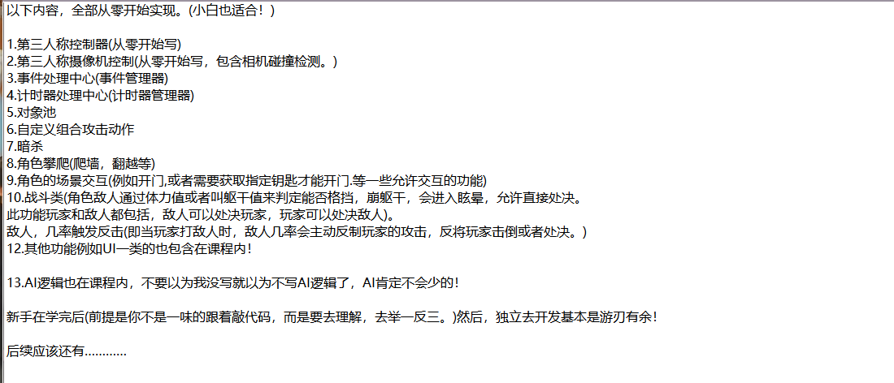


# 数学

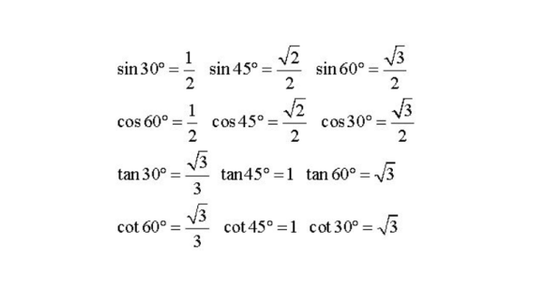 


##  **向量在平面上的投影**

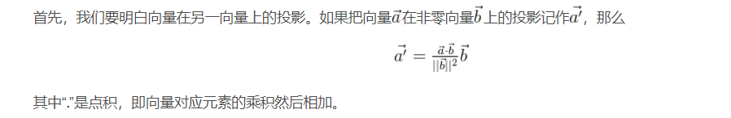 

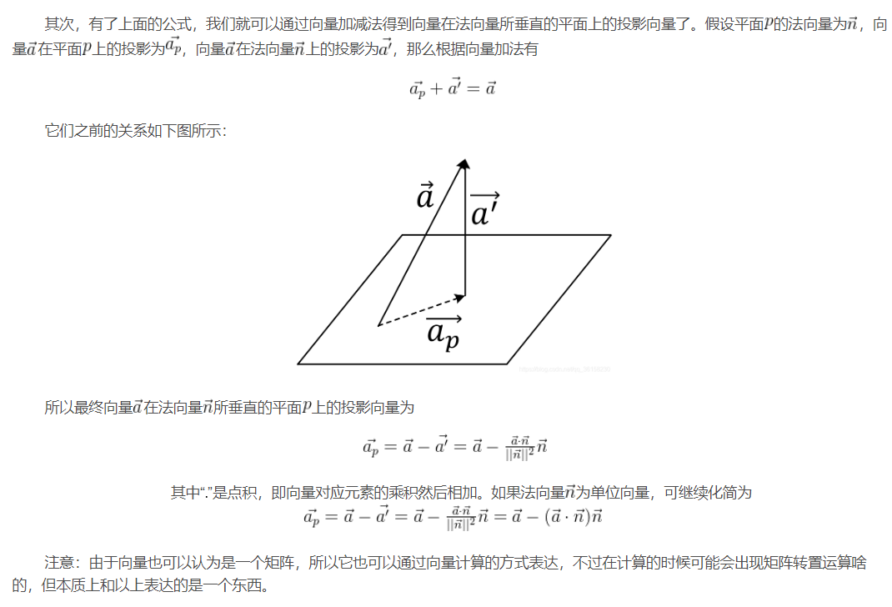


## 线性插值

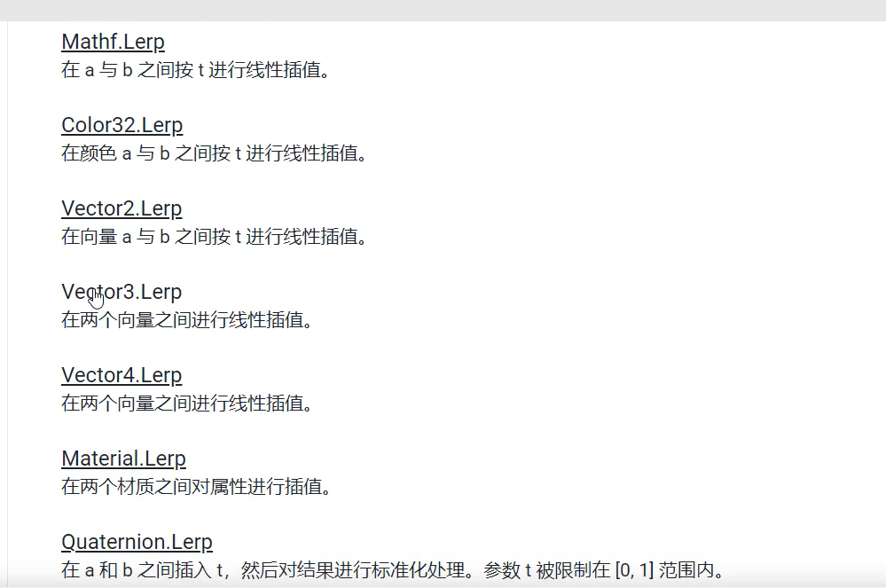

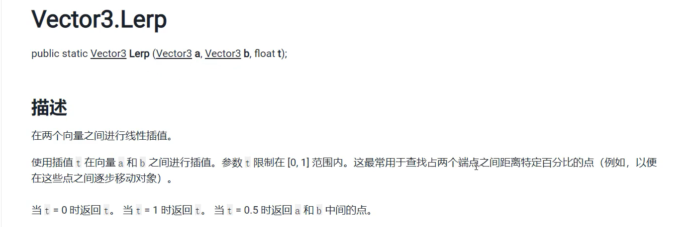

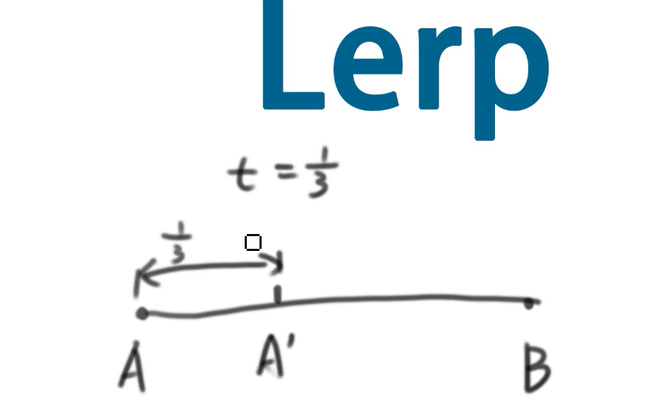 


# bug

**1.父物体和子物体坐标坐标问题**

当一个父物体挂载一个子物体，此时在hierarchy面板点击父物体，它的坐标系图标回在父子物体中间，而不是父物体上。

点击子物体的话还是在子物体上。个人推想：父物体就是整个父子坐标系的中心。


**2.模型导入白色或者粉红色**

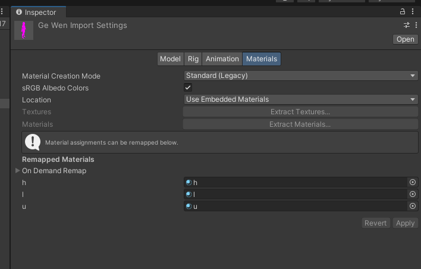 

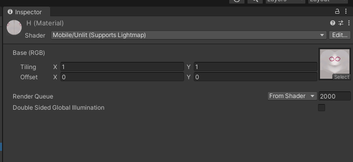 

修改材质的Shader就行了


**3.动画无法退出**

has exit time 没有勾选，也不知道为啥，这要我取研究一下动画；

问题解决：如果你没有再状态机中设置其他其他的退出条件并且没有勾选has exit time，那么动画播放完就算了。 


# 项目设置

1.导入input system，因为我们要用到这个新的输入系统

2.勾选Ente Play Mode Settings，开始播放的时候更快。

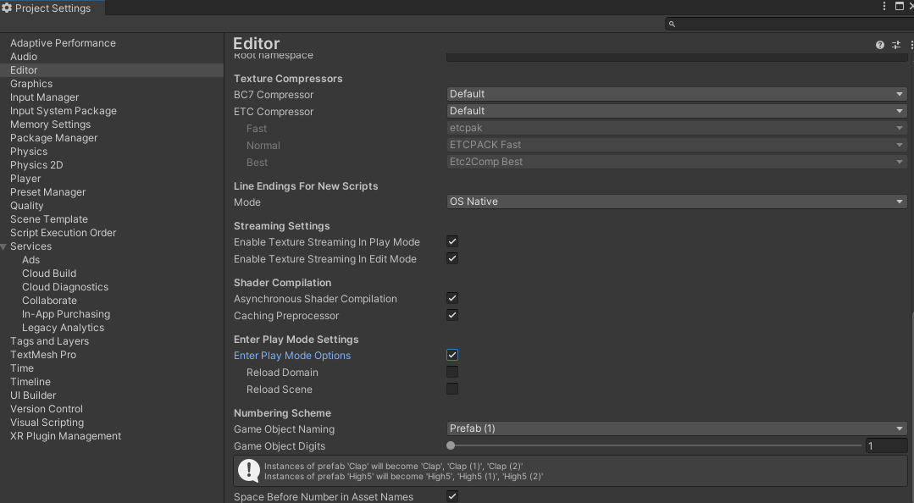 

在Unity中，"Enter Play Mode Settings"（进入播放模式设置）是指在进入播放模式（Play Mode）时应用的一些设置。这些设置允许你配置编辑器在你启动游戏时的行为，以及在离开播放模式时的一些操作。以下是一些常见的 "Enter Play Mode Settings"：

1. **Scene Reload Mode (场景重载模式)：**
   - **Reload All (全部重载)：** 在进入播放模式时重新加载所有场景。
   - **Single (单个)：** 只重新加载当前活动的场景。
2. **Script Changes While Playing (脚本在播放时更改)：**
   - **Recompile And Continue Playing (重新编译并继续播放)：** 在脚本更改时重新编译并保持游戏继续运行。
   - **Recompile After Finished Playing (在播放结束后重新编译)：** 在退出播放模式后再重新编译脚本。
3. **Capture Play Mode (捕获播放模式)：**
   - **Enable (启用)：** 在进入播放模式时启用Scene视图和Game视图的截图功能。
   - **Disable (禁用)：** 在播放模式时禁用截图功能。

这些设置可以在Unity编辑器的菜单栏中找到。选择 "Edit"（编辑） -> "Project Settings"（项目设置） -> "Editor"（编辑器），然后你会看到 "Enter Play Mode Settings" 部分。

选择适当的设置可以帮助你在开发过程中更有效地调试和测试游戏。例如，选择适当的场景重载模式可以影响你在播放模式中所做的更改如何被应用。


# 角色控制器

在Unity中，一个角色控制器（Character Controller）通常需要实现以下功能以实现基本的玩家角色移动和交互：

**移动：** 角色控制器需要处理玩家输入（例如键盘、鼠标、手柄）并将其转换为角色在游戏场景中的移动。这包括前进、后退、左右移动、跳跃等。

**碰撞检测：** 角色控制器需要检测与环境中其他物体的碰撞，以避免穿透物体或出现不自然的行为。通常，这涉及到使用碰撞体（Colliders）与触发器（Triggers）来进行碰撞检测。

**重力：** 角色通常受到重力的影响，角色控制器需要处理重力，确保角色在没有输入时能够垂直地下落，并在跳跃时克服重力。

**跳跃：** 角色控制器需要处理跳跃输入，计算跳跃的高度，并在适当的时候使角色跃起。

**互动：** 如果游戏中有互动元素，例如与物体互动、开关、对话等，角色控制器需要处理这些互动，通常通过检测玩家输入或与互动对象的碰撞触发器。

**相机控制：** 如果游戏使用第一人称或第三人称视角，角色控制器可能需要控制相机的位置和旋转，以确保玩家能够适当地看到角色周围的环境。

**动画：** 角色控制器通常需要与动画系统集成，以播放角色的动画。这可能涉及到根据角色的移动状态切换不同的动画状态。

**状态管理：** 角色可能有不同的状态，例如行走、奔跑、跳跃、下蹲等。角色控制器需要管理这些状态，并根据当前状态来执行相应的行为。

**输入管理：** 角色控制器需要处理玩家输入，包括键盘、鼠标、手柄等。这可能需要使用Unity的Input系统或其他输入管理工具。

**音效：** 角色的移动、跳跃等行为可能伴随着音效。角色控制器可能需要触发相应的音效以增强游戏体验。

这些功能可以根据游戏的具体需求而有所变化，但通常是实现一个基本的角色控制器所需的核心功能。 Unity的Character Controller组件是一个内置的控制器，用于处理角色的基本运动和碰撞检测。


## 角色移动

我们有哪些个角色呢？

自己控制的ctlCharacter、敌人aiCharacter、网络同步的syncCharacter

虽然它们都用于不同的characet用于不同的场景，但是呢它们显然是有一些共同的功能的，所以我们需要创建一个角色移动的基类

**CharacterMovementControllerBase**


这里移动我们使用charactercontroller来帮我们实现，并且需要播放动画，所以我们获取下面这两个组件。

```
protected CharacterController _controller;
protected Animator _animator;
```


### todo

不仅重力要设置一个开启的标记，movement也需要设置一个开启的标记，因为角色死亡后，脚本再执行就有问题了。

并且也浪费资源，是否选择销毁整个角色比较好呢？我们的脚本添加有一点多啊。

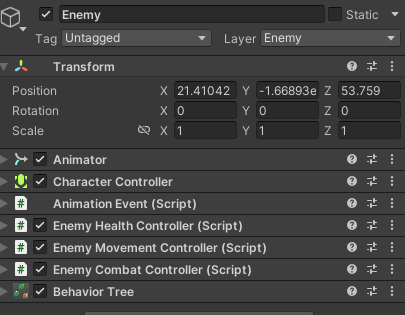 

角色死亡后因为脚本没有关闭，unity还是会一直调用这些个脚本，就会报这个警告

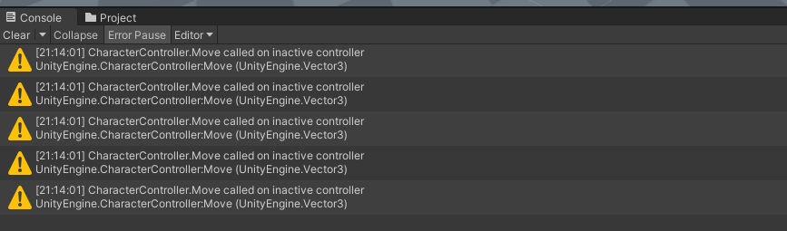 


### **地面检测相关**

地面检测注意是给重力来服务的，因为人物不在地面的时候，我们需要给角色添加一个重力加速度来模拟一个重力的效果

```c#
protected bool _characterIsOnGroud;               //角色是否在地面上                      
protected float _groudDetectionPositionOffset;    //用于调整检测点的offset，这是相对于角色模型的position的
protected float _detectionRang;                   //检测范围，因为我们使用一个sphere碰撞器来检测是否接触地面
protected LayerMask _whatIsGround;                //检测场景，只去检测被标记为groud的layer，其他的就忽略掉
```

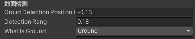 

```c#
//地面检测
private bool GroundDetection(){
	var detectionPosition = new Vector3(transform.position.x, transform.position.y - _groudDetectionPositionOffset, transform.position.z);
	return Physics.CheckSphere(detectionPosition, _detectionRang, _whatIsGround, QueryTriggerInteraction.Ignore);
}
```


### **重力相关**

这里把重力放到角色移动这里也比较合理吧

```c#
//重力加速度
protected readonly float CharacterGravity = -9.8f;      

//用于更新角色Y轴的速度(可以应用于重力和跳跃高度,砍敌人一刀，敌人往天上飞也可以用这个变量实现)
protected float _characterVerticalVelocity;

//角色最大的垂直方向速度，角色在低于这个值的时候，才需要应用重力
protected readonly float _characterVerticalMaxVelocity = 54f;

//角色的Y轴移动方向，因为是通过charactercontroller的move函数来实现重力。所以把_characterVerticalVelocity，应用到这个向量的Y值里面去更新
protected Vector3 _characterVerticalDireciton;           

//防止角色下楼梯的时候鬼畜，比如下楼梯时播放跌落动画。这个0.15秒用于缓冲，判断角色是不是在下楼梯
protected float _fallOutTime = 0.15f;                       

//配合_fallOutTime使用的下落时间计数
protected float _fallOutDeltaTime;

//是否启用重力
protected bool _isEnableGravity;                                
```


**在update中，我们先设置角色的重力，然后再更新角色的再重力方向上的位移**

```c#
protected virtual void Update()
{
	SetCharacterGracity();
	UpdateCharacterGravity();
}
```


**SetCharacterGracity**

设置角色受重力影响的速度_characterVerticalVelocity

```c#
private void SetCharacterGracity()
{
	if(!_isEnableGravity)return;
	
	_characterIsOnGroud = GroundDetection();

    if (_characterIsOnGroud)
    {
    	//如果角色在地面上需要重置FallOutTime
    	_fallOutDeltaTime = _fallOutTime;
    	//重置角色垂直速度
        if(_characterVerticalVelocity < 0f)
        {
        //如果这里不给他固定死，那么它会一直累积。当你第二次跳跃或者从高处跌落，那么你的下降速度就会很快。不会从慢到快。
        //固定-2，那么你第二次高出跌落，那么你的垂直速度就是从-2f开始计算
        //非固定，在地面还在一直累计，-100f或者-500f,这时候你在第二次高处跌落，那么你的垂直速度就是从-500开始计算
        	_characterVerticalVelocity = -2f;
        }
    }
    else
    {    
        //不在地面上
        if (_fallOutDeltaTime > 0)
        {
        //等待0.15秒用于缓冲，这个0.15秒用于帮助角色从较低的高度差下落(比如两节楼梯)，这么短的时间就没有必要播放下落的动作
        	_fallOutDeltaTime -= Time.deltaTime;
        }
        else
        {
        	//说明过来0.15秒角色还没有落地，可能不是在下楼梯，那么就有必要播放下落动画了
			//播放下落动画
        }

        //设置受重力影响下垂直方向上的速度
        //这里一直累加，知道大于最大的垂直速度
        if((-_characterVerticalVelocity) < _characterVerticalMaxVelocity)
        {
        	_characterVerticalVelocity += CharacterGravity * Time.deltaTime;
        }
    }
}
```


**UpdateCharacterGravity**

更新角色在重力方向上的位移,这里使用charactercontroller的Move方法来实现

```c#
private void UpdateCharacterGravity()
{
    if (!_isEnableGravity) return;
    _characterVerticalDireciton.Set(0, _characterVerticalVelocity, 0);
    _controller.Move(_characterVerticalDireciton * Time.deltaTime);
}
```


### 移动相关

我们使用动画来驱动移动，也就是我们这里使用rootmotion来进行移动，避免滑步的问题。

**OnAnimatorMove**

```
protected virtual void OnAnimatorMove()
{
    //告诉 Animator 使用动画中的 Root Motion 来影响游戏对象的移动。
    _animator.ApplyBuiltinRootMotion();                    
    //animator.deltaPosition上一帧动画的位置变化，所以你的动画需要带位移才能这样用
    UpdateCharacterMoveDirection(_animator.deltaPosition);
}
```


**UpdateCharacterMoveDirection**

使用rootmotion每帧给我们提供的位移变化，用charactercontroller来对游戏对象真正的position变化


    protected void UpdateCharacterMoveDirection(Vector3 diretion)
    {
        _moveDirection = SlopResetDirection(diretion);
        _controller.Move(_moveDirection * Time.deltaTime);
    }


**坡道检测**

在角色上下坡的时候，如果我们还像上面那样旨在xz平面上的移动很明显就不合理了，因为上下坡是有y方向上的移动的。

**那么我们怎么判断是否在一个坡上呢？**

我们在角色身上向下射出一条射线，如果被射线打到的物体表面法线和vector3是不是平行的话就是在坡上了

如果在坡上，我们应该获取到在坡上移动的这个向量，而不是xz平面上的向量

    private Vector3 SlopResetDirection(Vector3 moveDireciton)
    {
        //检测角色限制是否在坡上移动，防止角色下坡速度过快时，变成弹力球
        if (Physics.Raycast(transform.position + (transform.up * 5f), Vector3.down, out var hit, _controller.height * 0.85f, _whatIsGround, QueryTriggerInteraction.Ignore))
        {
            //点积==0 说明两个向量是垂直的，浮点值不会完全相等，只会无限接近
            //hit.normal是射线打到物体的法线
            if (hit.normal != Vector3.up)
            {
                //ProjectOnPlane:向量投影到normal对应的平面上。
                //比如：vec:(1,2,3) nor:(0,1,0)  得到的投影就是（1,0,3）
                return Vector3.ProjectOnPlane(moveDireciton, hit.normal);
            }
        }
        return moveDireciton;
    }


## 相机控制


### 基础控制

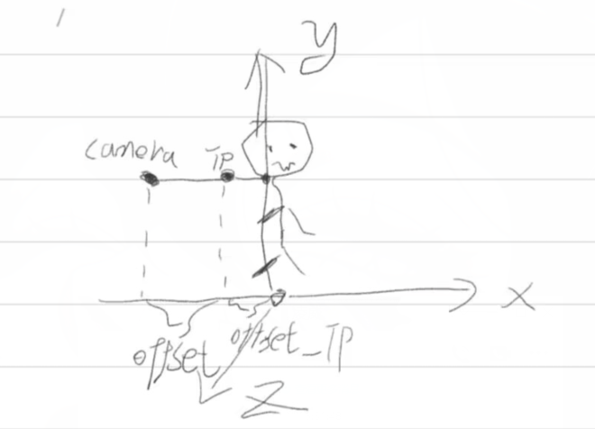 


创建一个空物体TP_Camera，游戏运行的时候这个空物体会不断更新自己的位置大概是角色的脖子处往后边一点（-0.1f）。

然后将一个摄像机作为这个空物体的子物体，给这个摄像机一点偏移。

这样在旋转空物体的时候，摄像机也会跟着空物体来旋转。也就是围绕着角色的脖子来旋转，这样就实现了摄像机的一直观察人物了。

```
using GGG.Tool;
using System.Collections;
using System.Collections.Generic;
using UnityEngine;

public class TP_CameraController : MonoBehaviour
{
    [Header("相机参数配置")]
    private Transform _lookTarget;
    [SerializeField] private float _positionOffset;                 
    [SerializeField] private float _controllerSpeed;                       //相机的移动速度
    [SerializeField] private float _positionSmoothTime;                    //相机移动平滑时间
    [SerializeField] private Vector2 _cameraVerticalMaxAngle;              //限制相机上下看的最大角度
    [SerializeField] private float _rotateSmoothTime;                      //相机旋转平滑时间
    private Vector3 _currentRotateVelocity = Vector3.zero;                 //当前相机的移动速度,这里设置为0

    private Vector2 _input;                                                //用于接收鼠标输入
    private Vector3 _cameraRotation;                                       //用于保存摄像机的旋转值


    private void Awake()
    {
        _lookTarget = GameObject.FindWithTag("CameraTarget").transform;
    }

    private void Update()
    {
        CameraInput();
    }

    private void LateUpdate()
    {
        UpdateCameraRotation();
        CameraPosition();
    }

    //获取鼠标输入
    private void CameraInput()
    {
        _input.y += InputManager.Instance.CameraLook.x * _controllerSpeed;              //左右看，旋转摄像机y轴
        _input.x += InputManager.Instance.CameraLook.y * _controllerSpeed;              //上下看，旋转摄像机x轴
        //限制仰角
        _input.x = Mathf.Clamp(_input.x, _cameraVerticalMaxAngle.x, _cameraVerticalMaxAngle.y);
    }

    //更新摄像机旋转
    private void UpdateCameraRotation()
    {
        _cameraRotation = Vector3.SmoothDamp(_cameraRotation, new Vector3(_input.x, _input.y, 0f),ref _currentRotateVelocity, _rotateSmoothTime);
        transform.eulerAngles = _cameraRotation;
    }

    //更新摄像机位置
    private void CameraPosition()
    {
        var newPosition = (_lookTarget.position + (-_lookTarget.transform.forward * _positionOffset));            //以_lookTarget位置为基准，向后移动_positionOffset
        transform.position = Vector3.Lerp(transform.position, newPosition, DevelopmentToos.UnTetheredLerp(_positionSmoothTime));
    }

}
    
```


### 相机碰撞

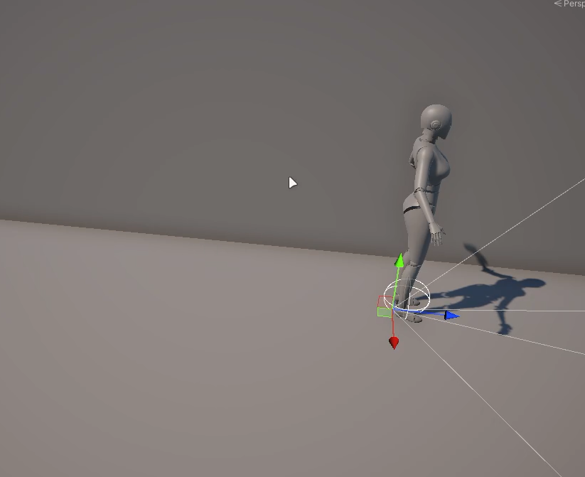 

坐标系图标对应的游戏物体是TP_Camera

TP_Camera向后方打出一条射线，如果检测到障碍物，就会调整相机与人物之间的距离。


```
using GGG.Tool;
using System.Collections;
using System.Collections.Generic;
using UnityEngine;

public class CameraCollider : MonoBehaviour
{

    [SerializeField, Header("最大最小偏移量")]          
    private Vector2 _maxDistanceOffset;                     //是和它的父物体为参照无做的偏移,最小起码是1
    [SerializeField, Header("检测层级"), Space(10)]
    private LayerMask _whatIsWall;
    [SerializeField, Header("射线长度"), Space(10)] 
    private float _detectionDistance;
    [SerializeField, Header("碰撞移动平滑时间"), Space(10)]
    private float _colliderSmoothTime;

    //开始的时候需要保存起始点和起始的偏移
    private Vector3 _originPosition;                                //这玩意没变过(0,0,-1)用作方向
    private float _originOffsetDistance;
    private Transform _mainCamera;

    private void Awake()
    {
        _mainCamera = Camera.main.transform;
    }

    private void Update()
    {
        UpadateCollider();
    }

    private void Start()
    {
        _originPosition = transform.localPosition.normalized;//normalized归一化之后就是(0,0-1),也就是我们TP_camera空物体的后方
        _originOffsetDistance = _maxDistanceOffset.y;
    }

    private void UpadateCollider()
    {
        var detectionDirection = transform.TransformPoint(_originPosition * _detectionDistance);                //这里转换是将以以父物体为中心的（0，0，-1）转换为世界坐标父物体正后方的方向
        if(Physics.Linecast(transform.position,detectionDirection,out var hit, _whatIsWall, QueryTriggerInteraction.Ignore))
        {
            //打到东西，就说明碰撞到东西，就让相机往前移动一段距离
            _originOffsetDistance = Mathf.Clamp(hit.distance *0.8f, _maxDistanceOffset.x, _maxDistanceOffset.y);
        }
        else
        {
            _originOffsetDistance = _maxDistanceOffset.y;
        }
        _mainCamera.localPosition = Vector3.Lerp(_mainCamera.localPosition, _originPosition * (_originOffsetDistance - 0.1f), DevelopmentToos.UnTetheredLerp(_colliderSmoothTime));
    }

}
```


### 相机处决

character在处决敌人的时候，相机要注视敌人

1.可以使用虚拟相机这个插件

2.自己写脚本


# 事件管理器

通过事件中心来通知目标对象：

比如说我们砍敌人一刀，然后通知敌人，你被我打到了，然后执行个一些操作

```
using System.Collections;
using System.Collections.Generic;
using UnityEngine;
using System;
using GGG.Tool;
using GGG.Tool.Singleton;

public class GameEventManager : SingletonNonMono<GameEventManager>
{

    //用于管理其子类
    private interface IEventHelp
    {
    }
   
    /// <summary>
    /// 无参数委托
    /// </summary>
    private class EventHelp : IEventHelp
    {
        private event Action _action;
        public EventHelp(Action action)
        {
            _action = action;
        }

        //添加事件
        public void AddCall(Action action)
        {
            _action += action;
        }

        //移除事件
        public void RemoveCall(Action action)
        {
            _action -= action;
        }

        //调用事件
        public void Call()
        {
            _action?.Invoke();
        }

    }

    /// <summary>
    /// 单参委托
    /// </summary>
    /// <typeparam name="T"></typeparam>
    private class EventHelp<T> : IEventHelp
    {
        private event Action<T> _action;
        public EventHelp(Action<T> action)
        {
            _action = action;
        }

        //添加事件
        public void AddCall(Action<T> action)
        {
            _action += action;
        }

        //移除事件
        public void RemoveCall(Action<T> action)
        {
            _action -= action;
        }

        //调用事件
        public void Call(T value)
        {
            _action?.Invoke(value);
        }

    }

    /// <summary>
    /// 双参委托
    /// </summary>
    /// <typeparam name="T"></typeparam>
    private class EventHelp<T1,T2> : IEventHelp
    {
        private event Action<T1, T2> _action;
        public EventHelp(Action<T1, T2> action)
        {
            _action = action;
        }

        //添加事件
        public void AddCall(Action<T1, T2> action)
        {
            _action += action;
        }

        //移除事件
        public void RemoveCall(Action<T1, T2> action)
        {
            _action -= action;
        }

        //调用事件
        public void Call(T1 value1,T2 value2)
        {
            _action?.Invoke(value1,value2);
        }

    }


    private Dictionary<string, IEventHelp> _eventCenter = new Dictionary<string, IEventHelp>();

    //添加事件监听:无参
    public void AddEventListening(string eventName,Action action)
    {
        //先判断事件中心有没有eventName这个事件
        if(_eventCenter.TryGetValue(eventName,out var e))
        {
            (e as EventHelp)?.AddCall(action);
        }
        else
        {
            //添加一个新的事件
            _eventCenter.Add(eventName, new EventHelp(action));
        }
    }
    //添加事件监听：单参
    public void AddEventListening<T>(string eventName, Action<T> action)
    {
        //先判断事件中心有没有eventName这个事件
        if (_eventCenter.TryGetValue(eventName, out var e))
        {
            (e as EventHelp<T>)?.AddCall(action);
        }
        else
        {
            //添加一个新的事件
            _eventCenter.Add(eventName, new EventHelp<T>(action));
        }
    }
    //添加事件监听：双参
    public void AddEventListening<T1,T2>(string eventName, Action<T1, T2> action)
    {
        //先判断事件中心有没有eventName这个事件
        if (_eventCenter.TryGetValue(eventName, out var e))
        {
            (e as EventHelp<T1, T2>)?.AddCall(action);
        }
        else
        {
            //添加一个新的事件
            _eventCenter.Add(eventName, new EventHelp<T1, T2>(action));
        }
    }

    //触发事件
    public void CallEvent(string eventName)
    {
        if(_eventCenter.TryGetValue(eventName,out var e))
        {
            (e as EventHelp)?.Call();
        }
        else
        {
            DevelopmentToos.WTF($"当前没有找到{eventName}事件");
        }
    }
    //触发事件：单参
    public void CallEvent<T>(string eventName,T value)
    {
        if (_eventCenter.TryGetValue(eventName, out var e))
        {
            (e as EventHelp<T>)?.Call(value);
        }
        else
        {
            DevelopmentToos.WTF($"当前没有找到{eventName}事件");
        }
    }
    //触发事件:双参
    public void CallEvent<T1,T2>(string eventName,T1 value1,T2 value2)
    {
        if (_eventCenter.TryGetValue(eventName, out var e))
        {
            (e as EventHelp<T1,T2>)?.Call(value1,value2);
        }
        else
        {
            DevelopmentToos.WTF($"当前没有找到{eventName}事件，无法调用");
        }
    }

    //移除事件
    public void RemoveEvent(string eventName,Action action)
    {
        if(_eventCenter.TryGetValue(eventName, out var e))
        {
            (e as EventHelp)?.RemoveCall(action);
        }
        else
        {
            DevelopmentToos.WTF($"当前没有找到{eventName}事件,无法移除");
        }
    }

    //移除事件:单参
    public void RemoveEvent<T>(string eventName, Action<T> action)
    {
        if (_eventCenter.TryGetValue(eventName, out var e))
        {
            (e as EventHelp<T>)?.RemoveCall(action);
        }
        else
        {
            DevelopmentToos.WTF($"当前没有找到{eventName}事件,无法移除");
        }
    }

    //移除事件:双参
    public void RemoveEvent<T1,T2>(string eventName, Action<T1, T2> action)
    {
        if (_eventCenter.TryGetValue(eventName, out var e))
        {
            (e as EventHelp<T1, T2>)?.RemoveCall(action);
        }
        else
        {
            DevelopmentToos.WTF($"当前没有找到{eventName}事件,无法移除");
        }
    }
}

```


# 角色爬墙

这玩意有点复杂，因为相关的动画机知识没学过

攀爬动作结束之间连接到角色的idle状态即可。

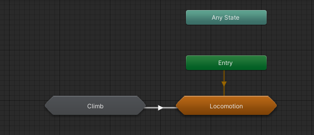 

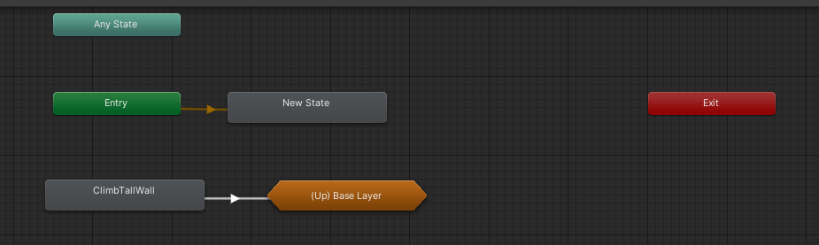 

1.按键触发爬墙动作，然后从角色身上向正前方打出一条射线，用于检测一定范围内可攀爬的墙体是否存在

2.计算出一个匹配点，然后关掉角色重力，播放攀爬动画

3.当动画播放到某个时间点之后就会重新启用角色重力


PlayerClimbController

```
using System.Collections;
using System.Collections.Generic;
using UnityEngine;

public class PlayerClimbController : MonoBehaviour
{

    private Animator _animator;

    [Header("检测")]
    [SerializeField] private float _detectionDistance;
    [SerializeField] private LayerMask _detectionLayer;

    private RaycastHit _hit;

    private void Awake()
    {
        _animator = GetComponent<Animator>();
    }

    private void Update()
    {
        CharacterClimbInput();
    }

    private bool CanClimb()
    {
        return Physics.Raycast(transform.position + (transform.up * 0.5f), transform.forward, out _hit, _detectionDistance, _detectionLayer, QueryTriggerInteraction.Ignore);
    }

    private void CharacterClimbInput()
    {
        if (!CanClimb()) return;
        if (InputManager.Instance.Climb)
        {
            //先去获取检测到的墙体信息
            var position = Vector3.zero;
            var rotation = Quaternion.LookRotation(-_hit.normal);
            position.Set(_hit.point.x, (_hit.collider.bounds.size.y - _hit.point.y) +_hit.point.y, _hit.point.z);//获取墙顶点的位置

            //不同的墙
            switch (_hit.collider.tag)
            {
                case "midWall":
                    ToCallEvent(position, rotation);
                    _animator.CrossFade("ClimbMidWall",0f,0,0f);
                    break;
                case "tallWall":
                    ToCallEvent(position, rotation);
                    _animator.CrossFade("ClimbTallWall", 0f, 0, 0f);
                    break;

                     
            }

        }
    }


    private void ToCallEvent(Vector3 position,Quaternion rotation)
    {
        GameEventManager.Instance.CallEvent("SetAnimationMatchInfo",position,rotation);
        GameEventManager.Instance.CallEvent("EnableCharacterGravity", false);
    }
}
  
```


这个是挂载到攀爬动作上面的SMB

AnimationMatchSMB

```
using System.Collections;
using System.Collections.Generic;
using UnityEngine;

public class AnimationMatchSMB : StateMachineBehaviour
{

    [Header("匹配信息")]
    [SerializeField] private float _startTime;
    [SerializeField] private float _endTime;
    [SerializeField] private AvatarTarget _avatarTarget;
    
    [Header("激活重力")]
    [SerializeField] private bool _isEnableGravity;
    [SerializeField] private float _enableTime;     //动画哪个时间点激活重力

    private Vector3 _matchPosition;
    private Quaternion _matchRotation;

    private void OnEnable()
    {
        GameEventManager.Instance.AddEventListening<Vector3, Quaternion>("SetAnimationMatchInfo", SetAnimationMatchInfo);
    }

    private void OnDisable()
    {
        GameEventManager.Instance.RemoveEvent<Vector3, Quaternion>("SetAnimationMatchInfo", SetAnimationMatchInfo);
    }


    public override void OnStateEnter(Animator animator, AnimatorStateInfo stateInfo, int layerIndex)
    {
        if (!animator.isMatchingTarget)
        {
            animator.MatchTarget(_matchPosition, _matchRotation, _avatarTarget, new MatchTargetWeightMask(Vector3.one, 0f),_startTime,_endTime);
        }
        if (_isEnableGravity)
        {
            if(animator.GetCurrentAnimatorStateInfo(0).normalizedTime > _enableTime)
            {
                //激活重力
                GameEventManager.Instance.CallEvent("EnableCharacterGravity", true);
            }
        }
    }


    private void SetAnimationMatchInfo(Vector3 position,Quaternion rotation)
    {
        _matchPosition = position;
        _matchRotation = rotation;
    }


}

```


# 角色招式逻辑与数据分离

招式表(连招)   招式

用招式来组成招式表


# 计时器

多少时间后干某某事


# 对象池

复用，这个项目的对象不好


# 声音

AudioSource

这里感觉写的也不好，scriptobject配合对象池一顿操作感觉有点乱


# 角色转身跑

这玩意，就是要计算角度的增量来判断是否需要转身180


# 变招逻辑

切换连招表罢了


# 角色的生命控制脚本


# 敌人检测和伤害触发


方法1.按键检测：在移动的时候打一条射线，打到的那个人就是检测到的目标

优点：自由，

缺点：必须得看着敌人才能选中

```
        /// <summary>
        /// 方法一按键检测：更新检测的目标
        /// </summary>
        private void DetectionTarget()
        {
            if (Physics.SphereCast(transform.position + (transform.up * 0.7f), _detectionRange, _detectionDirection, 
                out var hit, _detectionDistance,1<<9,QueryTriggerInteraction.Ignore)){
                //检测到某个敌人
                _currentEnemy = hit.collider.transform;
            }
        }

        /// <summary>
        /// 更新攻击检测的方向
        /// 方向为0就说明从自己为中心画圆检测
        /// </summary>
        private void UpdateDetectionDirection()
        {
            _detectionDirection = (_cameraGameObject.forward * InputManager.Instance.Movement.y) + (_cameraGameObject.right * InputManager.Instance.Movement.x);
            _detectionDirection.Set(_detectionDirection.x, 0f, _detectionDirection.z);
            _detectionDirection = _detectionDirection.normalized;
        }
        #endregion
```


方法2.范围检测：在自己身边扩散一个球体空间，在空间里面的敌人 ，我们取一个最近的敌人作为我们的目标

        //1.以玩家为中心，取自定义的一个半径圆的范围内获取其中的敌人
        当前有目标，不再更新目标，直到当前目标消失或运动时清空重新获取
        //2.在当前玩家没有目标的时候，取距离自身最近的一名敌人作为目标
    		当前目标只要大于一定距离就更新目标，所以不需要运动时清空


 


# 处决


注意忽略碰撞


Animator.MatchTarget

1. `_animator`: 这是一个 Animator 类型的对象，通常用于处理游戏对象的动画。
2. `MatchTarget`: 这是 Animator 类的方法，用于在动画播放的特定时间范围内，将游戏对象的位置和旋转匹配到指定的目标位置和旋转。
3. `_currentEnemy.position + (-transform.forward * combo.TryGetComboPositionOffset(_currentComboIndex))`: 这部分计算了目标位置。首先，获取 `_currentEnemy` 对象的位置 (`_currentEnemy.position`)，然后通过一些偏移计算，将位置向当前对象 (`transform`) 的反方向（负的前方向 `transform.forward`) 进行一定的偏移。这个偏移可能与当前动画的连击（combo）有关，通过 `combo.TryGetComboPositionOffset(_currentComboIndex)` 来获取相应的偏移量。
4. `Quaternion.identity`: 表示目标旋转的 Quaternion，这里使用的是一个无旋转的 Quaternion，即 `Quaternion.identity`，保持当前的旋转状态不变。
5. `AvatarTarget.Body`: 指定要匹配的 Avatar 部位，这里是整个身体。
6. `new MatchTargetWeightMask(Vector3.one, 0f)`: 这是一个权重掩码，用于指定匹配的权重。在这里，`Vector3.one` 表示完全匹配位置和旋转，而 `0f` 表示完全不匹配。这个权重掩码允许你控制匹配的程度。
7. `startTime` 和 `endTime`: 这两个参数表示动画匹配的时间范围，即从动画的哪个时间点开始匹配到哪个时间点结束。

总体来说，这行代码的作用是在指定的动画时间范围内，将游戏对象的位置和旋转匹配到 `_currentEnemy` 对象的位置，并且通过一些偏移来调整位置，以实现更加复杂的动画效果，可能与连击系统或敌人交互有关。


# 暗杀

和处决差不多


# 物理交互

开门、捡东西、npc对话.........

但是它们的交互的内部逻辑是不一样的。

所以我们要面向接口编程

IInteraction

```
using System.Collections;
using System.Collections.Generic;
using UnityEngine;

public interface IInteraction
{
    /// <summary>
    /// 交互行为
    /// </summary>
    void InteractionAction();

    /// <summary>
    /// 是否可以交互
    /// </summary>
    /// <returns></returns>
    bool CanInteraction();

}
```

InteractionBehaviour

```
public abstract class InteractionBehaviour : MonoBehaviour, IInteraction
{
    protected bool _canInteraction;				//是否可以交互

    protected virtual void Start()
    {
        _canInteraction = true;
    }

    public bool CanInteraction()
    {
        return _canInteraction;
    }

    /// <summary>
    /// 模板方法
    /// </summary>
    public void InteractionAction()
    {
        Interaction();
    }
    
    //让子类实现的交互事件
    protected abstract void Interaction();

}
```


这里举一个开灯的例子：

**开灯的交互行为实现类**

```
public class LightInteraction : InteractionBehaviour
{
    private Light _light;

    private void Awake()
    {
        _light = GetComponentInChildren<Light>();
        _light.enabled = false;
    }

    protected override void Interaction()
    {
        if (_light == null) return;
        _light.enabled = !_light.enabled;
    }
}

```


**开灯交互行为的控制器**

```
public class LigthContrl : MonoBehaviour
{

    public InteractionBehaviour _light;         //这个可以写成列表，一个控制器控制多个交互物品   //写成事件的集合也可以，直接呼叫事件中心     
    private bool canCantrol;                	//是否可以控制，因为某个交互事件可能会有多个控制器来触发

    private void Start()
    {
        canCantrol = false;
    }

	//这里使用轮询的方法来检测
    private void Update()
    {
        Control();
    }

    private void OnTriggerEnter(Collider other)
    {
        if (other.gameObject.CompareTag("Player"))
        {
            canCantrol = true;
        }
    }

    private void OnTriggerExit(Collider other)
    {
        if (other.gameObject.CompareTag("Player"))
        {
            canCantrol = false;
        }
    }

    private void Control()
    {
        if (!canCantrol) return;
        if (_light == null) return;
        if (InputManager.Instance.TakeOut)//E
        {
            _light.InteractionAction();
        }
    }
}
```


如果场景中的交互事件多了,也就相当于碰撞器使用得多了。严重影响性能

所以我们可以将地图分块，当玩家进入某个地图的时候就触发玩家进入场景事件

这个事件会通知观察者（也就是我们的交互事件管理器），让其开启本块地图中的交互事件。


# 角色生命


# ai行为

我们使用行为树

用行为树插件


# 角色带武器


将武器挂到角色身上


